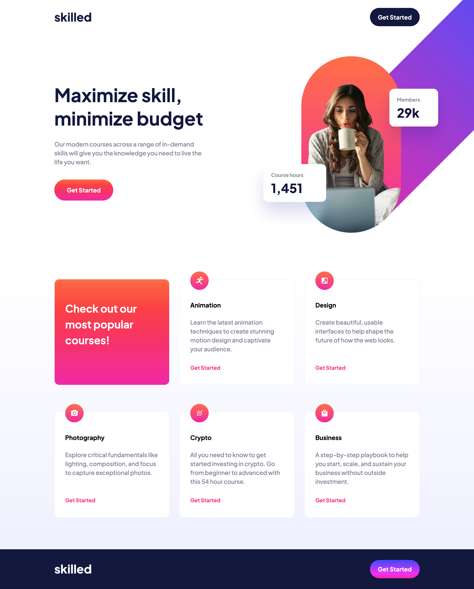
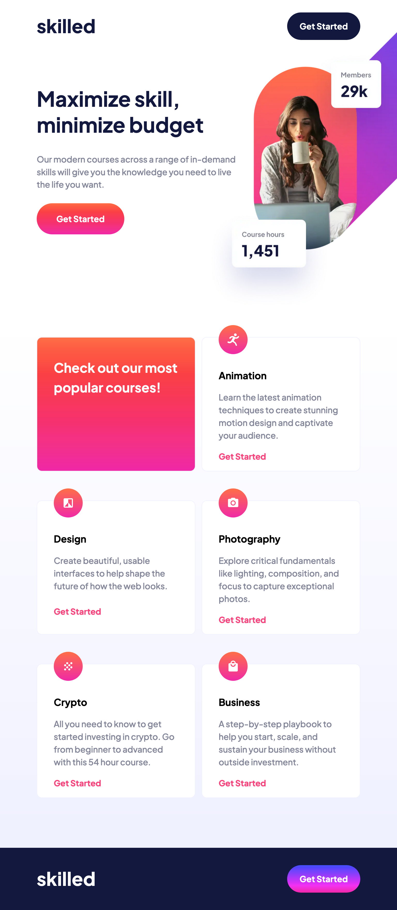
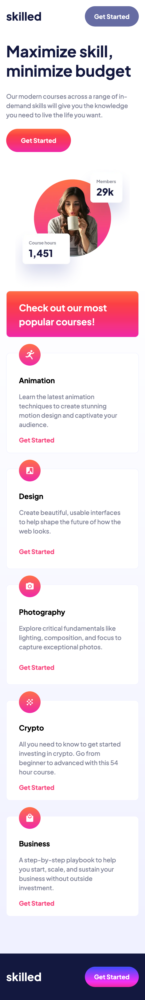

# Frontend Mentor - Skilled e-learning landing page solution

This is a solution to the [Skilled e-learning landing page challenge on Frontend Mentor](https://www.frontendmentor.io/challenges/skilled-elearning-landing-page-S1ObDrZ8q). Frontend Mentor challenges help you improve your coding skills by building realistic projects.

## Table of contents

- [Overview](#overview)
  - [The challenge](#the-challenge)
  - [Self assigned challenges](#self-assigned-challenges)
  - [Screenshots](#screenshots)
  - [Links](#links)
- [My process](#my-process)
  - [Built with](#built-with)
  - [What I learned](#what-i-learned)
  - [Continued development](#continued-development)
  - [Useful resources](#useful-resources)
- [Author](#author)

## Overview

### The challenge

Users should be able to:

- View the optimal layout depending on their device's screen size

### Self assigned challenges

- Try out Sass for the first time!
- Set up linear interpolation for size changes via a function in Sass.

### Screenshots

### Links

- [Solution URL](https://www.frontendmentor.io/solutions/skilled-elearning-site-built-with-saas-B9gU9PewWP)
- [Live Site URL](https://sh-skilled-elearning.netlify.app/)

## My process

### Built with

- Semantic HTML5 markup
- CSS custom properties
- Flexbox
- Grid
- Saas

### What I learned

- Making multiple image sources work using `<picture>` is a complete pain in the arse. I managed to get it working (with images for 2x pixel density and webp/png), only to realise that there wasnt really a way to make it work as a background image which felt more appropriate for the content... which meant I scrapped it anyways. Good to learn though!
- Sass is cool. Creating a function for linear interpolation was very satisfying.

### Continued development

- There has to be a way to achieve this kind of design without the use of media queries... but I'm not there yet.

### Useful resources

- [Saas Documentation](https://sass-lang.com/documentation/) - A constant open tab whilst learning how to use Saas.
- [Saas Tutorial for beginners](https://www.youtube.com/watch?v=_a5j7KoflTs) - Excellent video that got the ball rolling for me.

## Author

- Website - [Sam Hemingway](https://samhemingway.dev)
- Frontend Mentor - [@SamHemingway](https://www.frontendmentor.io/profile/samhemingway)